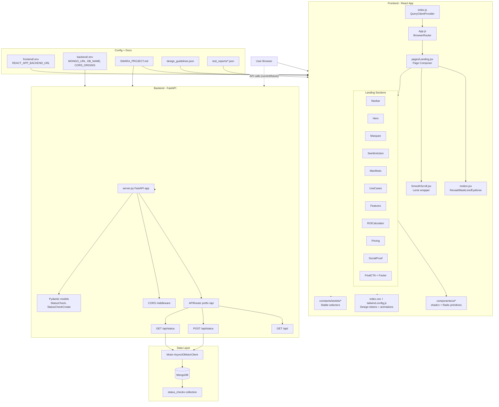

# Swara

<p align="center">
	<a href="#quick-start-windows-powershell"></a>
	<a href="#architecture-diagram-complete-system"></a>
	<a href="#update-log-required"></a>
</p>

<p align="center">
	
	
	
	
</p>

Swara is an AI voice-agent SaaS concept for businesses.

Today, this repository contains:
- A polished marketing landing page (production-quality frontend)
- A FastAPI + MongoDB backend scaffold for upcoming product APIs
- Product and design documentation for rapid iteration

## Quick Links

- [Quick Start](#quick-start-windows-powershell)
- [Architecture Diagram](#architecture-diagram-complete-system)
- [Tech Stack](#tech-stack)
- [Folder Map](#folder-map)
- [Update Log (Required)](#update-log-required)

## Tech Stack

| Layer | Stack |
|---|---|
| Frontend | React 19, CRACO, Tailwind CSS, shadcn/ui |
| Motion | framer-motion, Lenis |
| Backend | FastAPI, Uvicorn, Motor |
| Database | MongoDB |
| Tooling | pytest-xdist, ESLint, PostCSS |

## Folder Map

```text
Swara/
	frontend/                # React app (landing page)
	backend/                 # FastAPI server scaffold
	memory/                  # PRD and product memory docs
	test_reports/            # Iteration test artifacts
	SWARA_PROJECT.md         # Deep architecture and roadmap doc
	design_guidelines.json   # Visual and UX design contract
	README.md
```

## Quick Start (Windows PowerShell)

Run frontend and backend in separate terminals.

### 1) Frontend setup + run

```powershell
cd "c:\Users\skotta\Desktop\Personal Code\Swara\frontend"
yarn install
yarn start
```

If you prefer npm:

```powershell
cd "c:\Users\skotta\Desktop\Personal Code\Swara\frontend"
npm install
npm start
```

Open: http://localhost:3000

### 2) Backend setup + run

```powershell
cd "c:\Users\skotta\Desktop\Personal Code\Swara\backend"
python -m venv .venv
.\.venv\Scripts\Activate.ps1
pip install -r requirements.txt
uvicorn server:app --host 0.0.0.0 --port 8001 --reload
```

Backend:
- Base URL: http://localhost:8001
- API prefix: /api
- API docs: http://localhost:8001/docs

### 3) Required environment files

Frontend env file:

```powershell
@"
REACT_APP_BACKEND_URL=http://localhost:8001
"@ | Set-Content -Path "c:\Users\skotta\Desktop\Personal Code\Swara\frontend\.env"
```

Backend env file:

```powershell
@"
MONGO_URL=mongodb://localhost:27017
DB_NAME=Swara_db
CORS_ORIGINS=http://localhost:3000
"@ | Set-Content -Path "c:\Users\skotta\Desktop\Personal Code\Swara\backend\.env"
```

## Development Commands

### Frontend

```powershell
cd "c:\Users\skotta\Desktop\Personal Code\Swara\frontend"
yarn start
yarn build
yarn test
```

### Backend

```powershell
cd "c:\Users\skotta\Desktop\Personal Code\Swara\backend"
.\.venv\Scripts\Activate.ps1
pytest
```

## Architecture Diagram (Complete System)



## Current Product State

- Frontend landing page is complete and actively styled/animated.
- Backend is scaffolded and currently exposes status endpoints.
- Current backend routes:
	- GET /api/
	- POST /api/status
	- GET /api/status

## Important Files

- SWARA_PROJECT.md
- design_guidelines.json
- frontend/package.json
- frontend/src/pages/Landing.jsx
- backend/server.py
- backend/requirements.txt

## Update Log (Required)

This README must be updated for all meaningful product or architecture changes.

Rule:
- Every non-trivial change must add one new row to the log below in the same PR/commit.

Template:

| Date | Area | Change | Files | Notes |
|---|---|---|---|---|
| YYYY-MM-DD | Frontend/Backend/Infra/Docs | Short summary | file paths | Why it matters |

### Change Entries

| Date | Area | Change | Files | Notes |
|---|---|---|---|---|
| 2026-07-17 | Docs | Full README redesign with badges/buttons, startup flow, and complete architecture diagram | README.md | Improves onboarding speed and documentation quality |
| 2026-07-17 | Frontend | Reduced hero typography and voice demo footprint so marquee appears earlier at 100% zoom | frontend/src/components/Swara/Hero.jsx, frontend/src/components/Swara/VoiceDemo.jsx | Improves above-the-fold balance and reduces first-scroll dependency |
| 2026-07-17 | Frontend | Switched app logo rendering to use provided real logo asset | frontend/src/components/Swara/Logo.jsx, frontend/public/Swaralogo.jpg | Ensures brand consistency across navbar and footer |
| 2026-07-17 | Backend | Added Day 1 modular backend skeleton with package init files, health router, config module, and provider interfaces | backend/app/main.py, backend/app/routers/health.py, backend/app/core/config.py, backend/app/services/interfaces.py | Sets foundation for 7-day learning sprint architecture |

## Development Notes

- Do not hardcode backend URLs in frontend code. Use REACT_APP_BACKEND_URL.
- Keep backend routes under /api prefix.
- Prefer data-driven component content arrays for easy copy and pricing updates.
